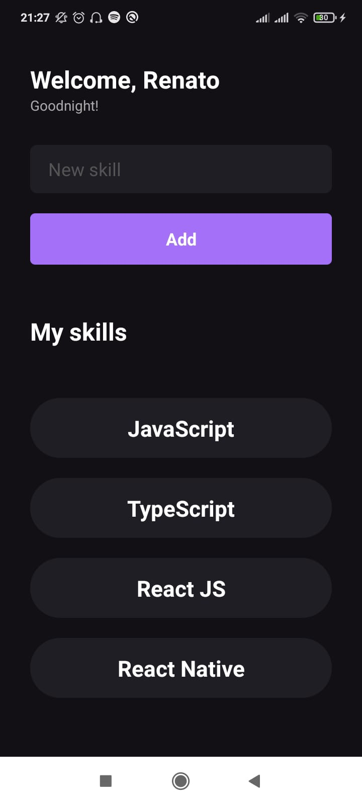

<h1 align="center">Skills</h1>

<div align="center">
  
</div>

---

##  About

This is a simple mobile **React Native** example.

My first Ignite project from Rocketseat! (with little changes)

## Technologies

- React Native
- TypeScript

Running the project:
---

````
step 1: Get the clone

step 2: Access the project name

step 3: Configure your device and type 'yarn android' or 'yarn ios' to start

````
---
Developed by - Renato Souza